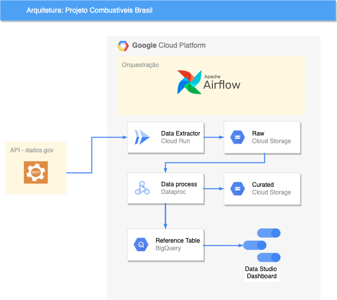
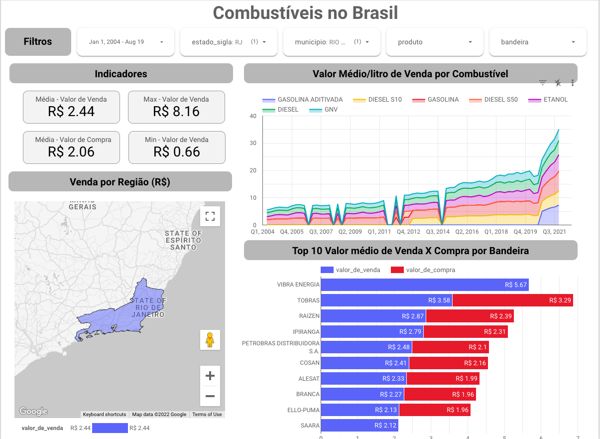

# Pipeline de dados - Combustíveis Brasil

O objetivo desse projeto foi criar um pipeline de dados para extrair informações de uma base de dados pública acerca do preço dos combustíveis no Brasil. 

- **Fonte de Dados:** 
  - Site: https://dados.gov.br/dataset/serie-historica-de-precos-de-combustiveis-por-revenda
  - Metadados: https://www.gov.br/anp/pt-br/centrais-de-conteudo/dados-abertos/arquivos/shpc/metadados-serie-historica-precos-combustiveis.pdf

Para este projeto, foram usados as seguintes tecnologias: 

- **Airflow**: Para realizar a tarefa de orquestrar o pipeline;
- **Google Cloud Storage:** Para armazenamento de dados Brutos e Curados;
- **Big Query:** Para armazenamento de dados curados;
- **DataStudio:** Para criação do Dashboard;
- **Google Cloud Dataproc:** Para processamento de dados com Spark;
- **Google Cloud Run:** Para hospedar a API que realize a coleta dos dados dos Combustíveis;

Os componentes foram organizados na seguinte arquitetura: 

Para o Airflow, foi utilizada uma imagem docker que está no diretório /airflow. Entretanto, para  subir o serviço localmente basta executar o comando **make** a partir do diretório raiz. 

A imagem abaixo ilustra a DAG criada para a orquestração. Existem dois operadores Dummy no inicio e fim para fins de organização. A task get_op é a responsável por realizar a chamada da API presente no Cloud Run e assim extrair os dados da fonte. Em seguida, a task create_cluster cria um cluster dataproc para realizar o processamento dos dados com Spark. A próxima task roda o job de processamento dentro do cluster recém criado e por último é feita a remoção do cluster.

A API foi feita utilizando o framework FastAPI e está presente no diretório /api. Para realizar o deploy dessa aplicação no Cloud Run basta executar o shell script presente na mesma pasta. Para que o deploy seja de fato realizado, é preciso estar logado em sua conta na Google Cloud Platform através da SDK. Caso ainda não tenha instalado, basta acessar esse [link](https://cloud.google.com/sdk/docs/install-sdk).

O pipeline em PySpark seguiu os seguintes passos: 

A função main recebe como parâmetro:
- path_input: Caminho dos dados no GCS gerados pela API coletora. Ex: gs://bucket_name/file_name.
- path_output: Caminho de onde será salvo os dados processados. Ex: gs://bucket_name_2/file_name.
- formato_file_save: Formato de arquivo a ser salvo no path_output. Ex: PARQUET.
- dataset: Dataset no BigQuery onde está a tabela.
- tabela_bq: Tabela do BigQuery que será salvo os dados. Ex: dataset.tabela_exemplo

Quanto a transformação de dados, foram realizadas as seguintes etapas: 

1. Faça a leitura dos dados de acordo com o path_input informado
2. Realize o rename de colunas do arquivo, respeitando os padrões do BigQuery
3. Adicione uma coluna de Ano, baseado na coluna `Data da Coleta`
4. Adicione uma coluna de Semestre, baseado na coluna de `Data da Coleta`
5. Adicione uma coluna Filename. Tip: pyspark.sql.functions.input_file_name
6. Faça o parse dos dados lidos de acordo com a tabela no BigQuery
7. Escreva os dados no Bucket GCS, no caminho informado `path_output`
no formato especificado no atributo `formato_file_save`.
8. Escreva os dados no BigQuery de acordo com a tabela especificada no atributo `tabela_bq`.

Por último, foi desenvolvido um dashboard usando a ferramenta Data Studio, da GCP. Abaixo está o link do relatório bem como o link para acesso (Nessa parte do projeto peço desculpas pois data viz não é o meu forte mas estou em busca de melhora 🙃 ). 

[Link](https://datastudio.google.com/s/o8V6TJH3OQU) para o dashboard.

